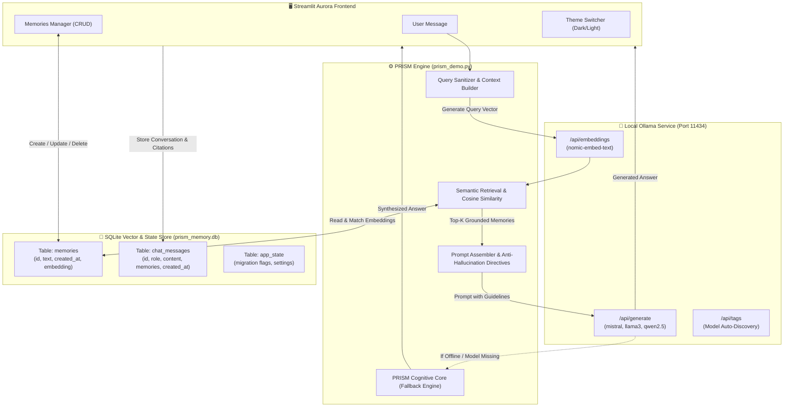

<div align="center">

# 💎 PRISM v1.0
### *Privacy-Preserving, Personality-Driven Digital Twin with Long-Term Contextual Memory*

[](https://python.org)
[](https://streamlit.io)
[](https://sqlite.org)
[](https://ollama.ai)
[](test_prism.py)
[](#-privacy--local-first-guarantee)
[](LICENSE)

<br/>

> **PRISM** (**P**ersonal **R**eflective **I**ntelligence with **S**tateful **M**emory) is an entirely private, locally running AI Digital Twin. It learns your interests, background, preferences, and ongoing projects—retaining them inside an ACID-compliant SQLite vector-store and grounding every answer using local open-source models via Ollama.
>
> 🔒 **100% Local. Zero API Keys. Zero Cloud Leakage. Complete Data Sovereignty.**

---

</div>

## 📑 Table of Contents

- [✨ Overview](#-overview)
- [🚀 Key Features](#-key-features)
- [🔄 Evolution: What Changed from Legacy to v1.0](#-evolution-what-changed-from-legacy-to-v10)
- [🏗️ System Architecture](#️-system-architecture)
- [💾 Database Schema](#-database-schema)
- [⚡ Quickstart & Installation](#-quickstart--installation)
- [🎮 How to Use PRISM](#-how-to-use-prism)
- [⚙️ Configuration & Personalization](#️-configuration--personalization)
- [🧪 Automated Test Suite](#-automated-test-suite)
- [📂 Project Structure](#-project-structure)
- [🔒 Privacy & Local-First Guarantee](#-privacy--local-first-guarantee)
- [🗺️ Future Roadmap](#️-future-roadmap)
- [🤝 Contributing & License](#-contributing--license)

---

## ✨ Overview

Traditional AI assistants forget your identity as soon as you close the browser or start a new thread. Cloud-hosted alternatives store your private thoughts, personal preferences, and intellectual property on external corporate servers.

**PRISM** bridges this gap:
- **Private & Local-First**: Powered entirely by [Ollama](https://ollama.ai) embeddings and LLMs running directly on your machine.
- **Persistent Long-Term Memory**: Stored permanently in SQLite with vector embeddings, allowing instant recall across sessions.
- **Context-Grounded & Non-Hallucinatory**: Explicit system prompt directives force PRISM to only claim personal facts verified in your memories, while answering general knowledge freely.
- **Autonomous Cognitive Core**: Equipped with an embedded fallback engine that keeps conversational integrity intact even when an external LLM model is offline.

---

## 🚀 Key Features

### 🧠 1. Robust SQLite Memory Store
- **Full CRUD Capabilities**: Add, inspect, search, live-edit (with automatic re-embedding), and delete individual memories or clear all.
- **One-Time Zero-Loss Migration**: Automatically imports legacy JSON memory stores (`memory_store.json`) without data corruption or duplicates.
- **Embedding Co-location**: Embeddings are stored right alongside text records with precise UTC timestamps.

### ⚡ 2. Semantic Search & Memory Retrieval (RAG)
- Powered by Ollama's local embeddings (`nomic-embed-text` by default).
- Strict Cosine Similarity scoring with an intelligent relevance threshold (`SIMILARITY_THRESHOLD = 0.50`).
- **Zero Random-Vector Fallbacks**: Unlike naive scripts, PRISM validates vectors, rejects corrupted dimensions, and issues actionable setup hints if a model is missing.

### 🛡️ 3. Anti-Hallucination & Evidence Grounding
- **Strict Evidence Boundaries**: If personal information is missing from memory, PRISM openly admits it rather than inventing false details.
- **Source Provenance / Citations**: Expandable `🔍 Memories used` chips appear beneath every response so you can audit exactly what context PRISM drew from.
- **Multi-Turn Context Window**: Feeds recent turns (`HISTORY_TURNS = 6`) into the prompt to resolve pronouns and conversational references naturally.

### 💬 4. Persistent Chat History Across Sessions
- Conversation history is saved directly to SQLite (`chat_messages` table).
- Refreshing the browser or restarting Streamlit preserves your chat history seamlessly.
- Includes a one-click **🧹 Clear Chat History** button that clears conversations without touching your valuable saved memories.

### 🎨 5. Aurora UI with Dynamic Dark & Light Themes
- **Dynamic Theme Switcher**: Toggle effortlessly between **🌙 Dark** and **☀️ Light** modes with responsive CSS variables.
- **Aurora Color Accents**: Modern aesthetic featuring Cyan (`#06b6d4`), Indigo (`#6366f1`), Pink (`#ec4899`), and Emerald (`#10b981`).
- **Live Metrics Dashboard**: Real-time counter tiles for Conversation Turns, Total Saved Memories, and Active Engine Mode.
- **Interactive Memories Manager**: Dataframe view with search filter, inline update forms, and guarded deletion zone.

### 🧠 6. Built-in PRISM Cognitive Core
- If an Ollama chat model isn't yet pulled or is temporarily offline, PRISM gracefully falls back to its embedded local engine.
- Synthesizes retrieved memories, handles greetings, answers queries safely, and offers proactive setup tips.

---

## 🔄 Evolution: What Changed from Legacy to v1.0

PRISM has evolved from a primitive, error-prone script into an enterprise-grade local digital twin. Here is a breakdown of all major architectural improvements:

| Dimension | ⚠️ Legacy Version (`pp4.py` / Initial CLI) | 💎 PRISM v1.0 (`prism_demo.py`) |
|:---|:---|:---|
| **Storage Architecture** | Flat `memory_store.json` prone to race conditions, overwrite bugs, and syntax corruption. | **Thread-safe SQLite database (`prism_memory.db`)** with transactional integrity. |
| **Chat Persistence** | Ephemeral `st.session_state` — all conversations lost on browser reload. | **Persistent SQLite chat store** (`chat_messages`) with timestamps and memory citations. |
| **Embedding Handling** | Silent fallback to `np.random.rand(768)` which contaminated similarity search with noise. | **Deterministic Ollama embeddings** with finite vector validation and zero random hacks. |
| **Error Handling** | Silent failures or generic tracebacks without resolution steps. | **Custom exceptions** (`OllamaServiceError`, `OllamaModelNotFoundError`) with `ollama pull` suggestions. |
| **Memory Management** | Read-only listing; no way to edit or delete memories without raw JSON edits. | **Full Interactive CRUD**: Add form, search filter, dataframe inspection, inline text editing with auto re-embedding, and selective deletion. |
| **Retrieval Filtering** | Unbounded Top-K retrieval returning irrelevant texts even with low similarity. | **Cosine similarity thresholding** (`0.50`) with dimension matching and query sanitization. |
| **Prompt Engineering** | Unconstrained prompt prone to hallucinating facts about the user. | **Four Core Directives**: Strict grounding, anti-hallucination guardrails, general knowledge segregation, and multi-turn context. |
| **User Interface** | Basic dark styling with hardcoded inline CSS. | **Aurora Design System**: Dynamic 🌙 Dark / ☀️ Light mode, hero glassmorphic card, metric tiles, badges, and tab navigation. |
| **Model Auto-Discovery** | Hardcoded model strings. | **Live Ollama `/api/tags` integration**: Automatically queries and dropdown-populates installed models. |
| **Testing** | 0 unit tests. | **14 Comprehensive Unit Tests** (`test_prism.py`) covering all 4 development steps. |

---

## 🏗️ System Architecture



---

## 💾 Database Schema

PRISM uses a clean, zero-configuration SQLite database (`prism_memory.db`):

```sql
-- 1. Persistent Memories & Embeddings
CREATE TABLE IF NOT EXISTS memories (
    id INTEGER PRIMARY KEY AUTOINCREMENT,
    text TEXT NOT NULL,
    created_at TEXT NOT NULL,
    embedding TEXT  -- JSON-serialized float array
);

-- 2. Persistent Chat Conversation History
CREATE TABLE IF NOT EXISTS chat_messages (
    id INTEGER PRIMARY KEY AUTOINCREMENT,
    role TEXT NOT NULL,         -- 'user' or 'assistant'
    content TEXT NOT NULL,
    memories TEXT,              -- JSON array of memories cited for response
    created_at TEXT NOT NULL
);

-- 3. Application State & Migration Registry
CREATE TABLE IF NOT EXISTS app_state (
    key TEXT PRIMARY KEY,
    value TEXT NOT NULL
);
```

---

## ⚡ Quickstart & Installation

### 1. Prerequisites
- **Python 3.10+** installed on your system.
- **[Ollama](https://ollama.ai)** installed and running locally.

### 2. Clone the Repository
```bash
git clone https://github.com/supernova1803/prismv1.git
cd prismv1
```

### 3. Create a Virtual Environment & Install Dependencies
```bash
# Windows (PowerShell)
python -m venv venv
.\venv\Scripts\Activate.ps1

# Linux / macOS
python3 -m venv venv
source venv/bin/activate

# Install required packages
pip install -r requirements.txt
```

> 💡 **Note:** `requirements.txt` contains only `streamlit` and `numpy`. Everything else (SQLite, json, urllib, unittest) uses standard Python libraries!

### 4. Pull Your Ollama Models
Ensure Ollama is running (`ollama serve` or open the desktop app), then download the embedding model and your preferred chat model:

```bash
# 1. Required: Embedding Model
ollama pull nomic-embed-text

# 2. Recommended: Generative Chat Model (Pick any or all)
ollama pull mistral
ollama pull llama3.2
ollama pull qwen2.5:0.5b
```

### 5. Launch PRISM
```bash
streamlit run prism_demo.py
```

Your browser will automatically open at `http://localhost:8501`.

---

## 🎮 How to Use PRISM

### 💬 Chatting with Your Digital Twin
1. Open the **💬 Chat with PRISM** tab.
2. Ask questions about your interests, work, or hobbies:
   - *"What programming languages do I like?"*
   - *"What robotics projects have I worked on?"*
3. PRISM will search your SQLite memory bank, find semantically relevant memories, and formulate a personalized response.
4. Click the **🔍 Memories used** expander below the answer to inspect exactly which memories were used.

### 🧠 Managing Memories
1. Switch to the **🧠 Memories Manager** tab.
2. **Add a Memory**: Type a statement (e.g., *"I am building a smart garden monitor with ESP32 and MQTT."*) and click **Save Memory**. It will automatically be embedded and stored in SQLite.
3. **Search Memories**: Use the real-time search box to find specific facts.
4. **Edit / Re-Embed**: Select any memory from the dropdown, edit its text, and click **Update Memory**. PRISM will recalculate its embedding immediately.
5. **Delete**: Safely remove outdated facts individually or use the Danger Zone to clear all memories.

### 🎨 Customizing Appearance
- In the left sidebar under **🎨 Appearance & Theme**, choose between **🌙 Dark** (sleek futuristic palette) and **☀️ Light** (crisp modern styling).

---

## ⚙️ Configuration & Personalization

### 🎭 Personality Profile (`personality.json`)
You can tweak PRISM's personality and tone at any time by editing [personality.json](personality.json):

```json
{
  "tone": "technical and enthusiastic",
  "style": "concise but expressive",
  "interests": "I love working on robotics and embedded systems., I usually write code in Python and Java., I enjoy making DIY electronics projects."
}
```

### 🔧 Tuning Constants (`prism_demo.py`)
Key parameters can be adjusted directly at the top of [prism_demo.py](prism_demo.py):

| Variable | Default Value | Description |
|:---|:---|:---|
| `SIMILARITY_THRESHOLD` | `0.50` | Minimum cosine similarity required to inject a memory into prompt context. |
| `HISTORY_TURNS` | `6` | Number of previous conversation turns included in prompt history. |
| `DEFAULT_EMBED_MODEL` | `"nomic-embed-text"` | Ollama embedding model name. |
| `DEFAULT_CHAT_MODEL` | `"mistral"` | Default generative chat model. |
| `DB_FILE` | `"prism_memory.db"` | SQLite database path. |

---

## 🧪 Automated Test Suite

PRISM includes an end-to-end unit test suite in [test_prism.py](test_prism.py) covering database migrations, vector math, error reporting, prompt assembly, and memory isolation.

To run the full suite:

```bash
python test_prism.py
```

### Test Coverage Summary:
- **`TestPrismStep1`**: Schema creation, one-time JSON migration idempotency, CRUD operations.
- **`TestPrismStep2`**: Elimination of random fallback vectors, dimension validation, cosine similarity thresholding, and missing model hints.
- **`TestPrismStep3`**: Context turn injection, context limit bounding (`HISTORY_TURNS`).
- **`TestPrismStep4`**: Evidence grounding directives, anti-hallucination rules, persona injection.
- **`TestPrismChatPersistence`**: SQLite chat history preservation, memory citation storage, and chat-wipe isolation.
- **`TestPrismLocalTwinEngine`**: Built-in conversational fallback verification.

---

## 📂 Project Structure

```
prismv1/
├── 📄 README.md                 # Project documentation & GitHub showcase
├── 📄 requirements.txt          # Python dependencies (streamlit, numpy)
├── 📄 personality.json          # Digital twin persona, tone & interests
├── 📄 memory_store.json         # Legacy JSON memory store (auto-migrated)
├── 🐍 prism_demo.py             # Main application & Streamlit Aurora UI
├── 🐍 test_prism.py             # Comprehensive 14-test verification suite
├── 🐍 pp4.py                    # Legacy reference prototype
├── 💾 prism_memory.db           # SQLite database (memories, chat, state)
└── 📁 .gitignore                # Git ignore configuration
```

---

## 🔒 Privacy & Local-First Guarantee

| Feature | PRISM v1.0 | Cloud AI Twins |
|:---|:---:|:---:|
| **Storage Location** | 🏠 Local SQLite on your hard drive | ☁️ Third-party cloud servers |
| **Model Inference** | 💻 100% On-Device (Ollama) | 🌐 Remote API endpoints |
| **Internet Required** | ❌ No (Works completely offline) | ✅ Yes (Mandatory) |
| **Data Tracking / Telemetry**| ❌ Zero telemetry | ⚠️ Often used for model training |
| **API Costs** | 🆓 Completely Free | 💳 Per-token / Subscription fees |

---

## 🗺️ Future Roadmap

- [ ] **Multi-Modal Memory**: Image upload and vision embeddings using `llava` / `moondream`.
- [ ] **Hierarchical Knowledge Graph**: Graph-based memory clustering for complex technical knowledge trees.
- [ ] **Voice Interaction**: Local speech-to-text (Whisper) and text-to-speech (Piper) for real-time voice conversations.
- [ ] **Encrypted At-Rest DB**: Optional SQLCipher integration for hardware-encrypted memory databases.
- [ ] **Memory Import/Export**: One-click JSON/CSV backup and restore.

---

## 🤝 Contributing & License

Contributions, feature requests, and bug reports are very welcome!

1. Fork the repository.
2. Create your feature branch (`git checkout -b feature/AmazingFeature`).
3. Commit your changes (`git commit -m 'feat: Add AmazingFeature'`).
4. Push to the branch (`git push origin feature/AmazingFeature`).
5. Open a Pull Request.

Distributed under the **MIT License**. See `LICENSE` for details.

---

<div align="center">

Built with ❤️ by **[Priyanshu Singh](https://github.com/supernova1803)** for the open-source & local AI community.

*If you found PRISM useful, consider giving the repository a ⭐️ on GitHub!*

</div>
